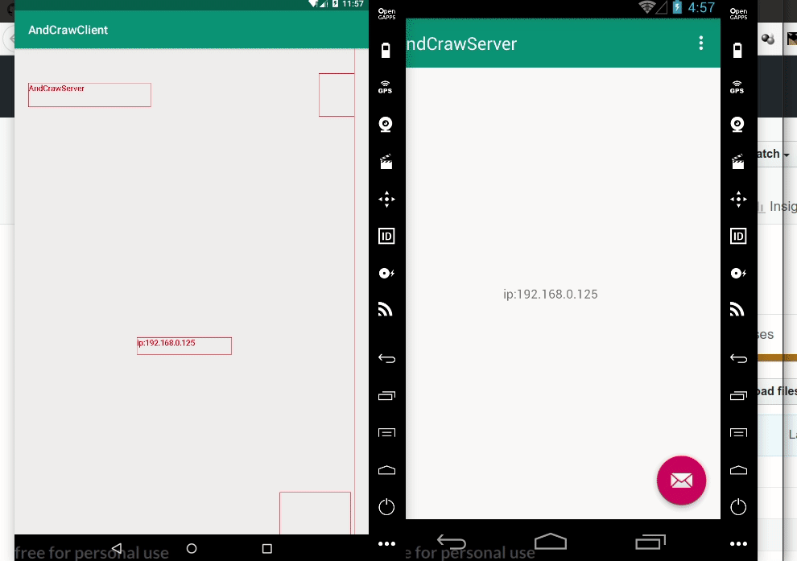

通过服务服务获取安卓手机界面的界面数据(服务端)

>本来是写来采集安卓手机界面数据,不过暂时做成了界面预览

服务端使用方法:

1. 安装到手机，在辅助服务打开这个应用

2. 查看ip地址

3. 使用客户端连接(客户端有android客户端和java客户端)

客户端使用方法:
1. 输入ip(需要在局域网内，即两台设备可以互相ping)
2. 连接即可

待完成：
- 完善界面
- 添加远程操作(点击等)
- python客户端
- 使用Xposed 来获取数据
- 类似录屏的功能(记录画面文字布局)

相关:
- java gui 客户端地址: https://github.com/FormatFa/andCraw_javaCli
- android 客户端地址: https://github.com/FormatFa/AndCrawClient

在局域网中，类似于直播的方式将一台手机的画面文字投放到另一台手机(或者PC)上面

演示，左边为客户端，右边为监控的服务端

